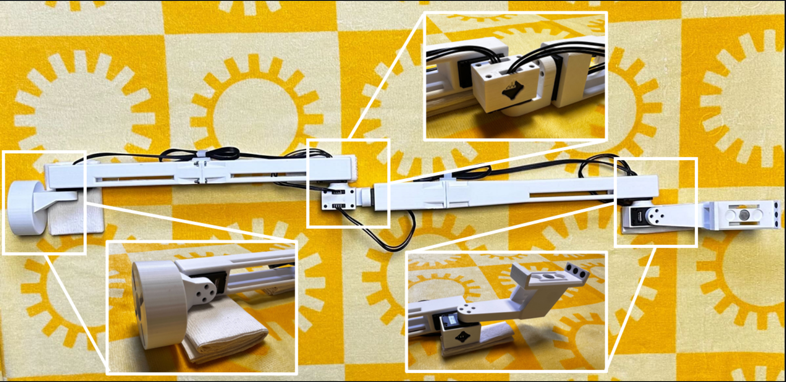

<h1 align="center"> ACE: A Cross-platform Visual-Exoskeletons
for Low-Cost Dexterous Teleoperation </h1>

<p align="center">
    <a href="https://aaronyang1223.github.io/" style="font-size: 20px;">
        Shiqi Yang
    </a>
    ·
    <a href="https://minghuanliu.com" style="font-size: 20px;">
        Minghuan Liu
    </a>
    ·
    <a href="https://yzqin.github.io" style="font-size: 20px;">
        Yuzhe Qin
    </a>
    ·
    <a href="https://dingry.github.io" style="font-size: 20px;">
        Runyu Ding
    </a>
    ·
    <a href="https://ace-teleop.github.io" style="font-size: 20px;">
        Jialong Li
    </a>
    <br>
    <a href="https://chengxuxin.github.io" style="font-size: 20px;">
        Xuxin Cheng
    </a>
    ·
    <a href="https://rchalyang.github.io" style="font-size: 20px;">
        Ruihan Yang
    </a>
    ·
    <a href="https://www.cs.cmu.edu/~shayi/" style="font-size: 20px;">
        Sha Yi
    </a>
    ·
    <a href="https://xiaolonw.github.io" style="font-size: 20px;">
        Xiaolong Wang
    </a>
</p>

<p align="center">
    
</p>

<h3 align="center"> CoRL 2024 </h3>

<p align="center">
<h3 align="center"><a href="https://ace-teleop.github.io/">Website</a> | <a href="http://arxiv.org/abs/2408.11805">arXiv</a> | <a href="https://github.com/ACETeleop/ACE_hardware">Hardware</a> </h3>
  <div align="center"></div>
</p>

<p align="center">

</p>

## 程序框图


## 介绍
该仓库包含了 ACE 的所有软件，主要包括三个组件：服务器、控制器和仿真。此外，我们还提供了用于设置硬件的实用工具。结合 ACE 硬件，你可以在仿真环境中快速使用各种末端执行器和机器人进行遥操作，或者使用控制器发出的指令在现实世界中操作机器人。有关 STL 文件和硬件搭建说明，请参阅 ACE 硬件仓库 ACE 以自行构建。
# 关键组件
服务器： 接收手部图像和关节角度作为输入，并在映射后输出手腕姿态和手部关键点。
控制器： 处理来自服务器的输入，并使用逆运动学（IK）生成控制指令。
仿真： 接收指令并在仿真环境中可视化操作。
# 创建虚拟环境
使用python3.8环境 只能使用仿真控制，无法控制真实机械臂。使用python 3.9环境只能控制真实机械臂，无法仿真控制。建议同时安装两种python的虚拟环境。
```bash
  pip install -e .
```

## 电机组装与校准
安装 dynamixel_wizard。
默认情况下，每个电机的 ID 为 1。为了使多个动力舵机能由同一个 U2D2 控制器板控制，每个动力舵机必须有一个唯一的 ID。ACE 有六个舵机，从基座到手腕，它们的 ID 应依次设置为 1 到 6。这个过程必须逐个电机进行。
# 步骤：
1.将单个电机连接到控制器，并将控制器连接到计算机。
2.打开 dynamixel wizard 并点击扫描以连接到电机。
3.对于每个舵机，将电机 ID 地址从 1 更改为目标 ID（1 到 6）。
4.对每个电机重复此过程，依次分配从 1 到 6 的唯一 ID。

下载```DYNAMIXEL Wizard```软件，[下载链接在此处](https://emanual.robotis.com/docs/en/software/dynamixel/dynamixel_wizard2/)，**将一个舵机单独直接连上板子**

```DYNAMIXEL Wizard```软件安装后打开：


点击图左上方齿轮图标，设置扫描参数如下：


点击图左上方的放大镜图标进行扫描：


根据接入顺序，可能是`/dev/ttyUSB0`或`/dev/ttyUSB1`，若扫描到结果如上图即成功。此窗口会自动关闭。

点击中间如图所示：


点击右侧栏ID选项，可设置ID。


向下滑动滚轮，可看到`Save`，保存即可。
依次操作，将两个机械臂分别进行1到6编号。
最后两个机械臂接上，扫描一下：


若得到如图所示效果，则配置成功。

# 获取偏移量
设置好电机 ID 后，你就可以连接到 ACE 硬件了。然而，每个电机都有其自身的关节偏移量，这会导致你的 ACE 硬件与 ACE URDF 之间存在差异。动力舵机具有对称的四孔图案，因此关节偏移量是 π/2 的倍数。为了解决这个问题，你可以使用以下代码来校准你的 ACE 硬件。

通过运行```ls /dev/serial/by-id```并查找以```usb-FTDI_USB**-**Serial_Converter ```开头的路径（在 Ubuntu 上）来找到你的 U2D2 Dynamixel 设备的端口 ID。
将 ACE 硬件设置为下图所示的姿势，然后运行代码



```python
  python3 -m ace_teleop.dynamixel.calibration.get_offset --port /dev/serial/by-id/usb-FTDI_USB**-**Serial_Converter_FT8J0QI3-if00-port0 --type left
```

# 姿态校准
获取偏移量后，进入 ace_teleop/dynamixel/calibration/config.py 并在 PORT_CONFIG_MAP 中添加一个 DynamixelRobotConfig。注意：你只需从文件中复制一个现有配置，并根据需要修改 port 和 joint_offsets 即可。
测试校准
校准完成后，你可以使用以下命令测试结果。你应该看到现实世界中的 ACE 硬件的行为与仿真中的行为相同。
```python
  python -m ace_teleop.dynamixel.calibration.test_calibration --port /dev/serial/by-id/usb-FTDI_USB__-__Serial_Converter_FT8J0QI3-if00-port0 --type left
```
注意：test_calibration 需要 sapien==3.0.0b0，这可能与 dex_retargeting==0.1.1 冲突。
建议创建一个单独的环境以避免潜在错误。

## 摄像头测试
查找摄像头索引并测试摄像头帧率
此代码将查找所有网络摄像头并显示帧率。
```python
  python3 -m ace_teleop.tools.find_webcam
```
获取摄像头索引后，进入 ace_teleop/configs/server 并更改相应 yml 文件中的 cam_num。

## 真实机械臂ip修改
请使用以太网线连接机械臂控制器和电脑，将以电脑太网口的IPV4配置为192.169.1.10。打开浏览器，若使用有线连接，则网址输入 192.168.1.18 进入登录页。若可进入登录界面，则连接正常。


在睿尔曼的机械臂操作界面内，将右臂的有线连接ip改为```192.168.1.19```

## 测试与运行
分别在仿真和真实环境下进行测试
# 仿真测试
在python 3.8环境下进行仿真测试，测试穿戴设备是否能够正确控制仿真机械臂
在一个终端中运行服务端
```python
  python scripts/start_server.py --config franka_gripper
```
在一个终端中运行仿真
```python
  python scripts/teleop_sim.py --config franka
```
# 真实机械臂测试
在python 3.9环境下进行仿真测试，测试穿戴设备是否能够正确控制仿真机械臂
在一个终端中运行服务端
```python
  python scripts/start_server.py --config franka_gripper
```
在一个终端中运行仿真

```python
  python scripts/teleop_cmd_py3.9.py --config franka
```

需要打开双手保持不动进行关节的初始化，在初始化过程种可以看见机械臂初始化的过程。
## Acknowlegments

This code base refers a lot to many previous amazing works like [BunnyVisionPro](https://github.com/Dingry/bunny_teleop_server), [OpenTeleVision](https://github.com/OpenTeleVision/TeleVision), [GELLO](https://github.com/wuphilipp/gello_software). Also, the codes are built on some superior public project, such as [pinocchio](https://github.com/stack-of-tasks/pinocchio) and [dex-retargeting](https://github.com/dexsuite/dex-retargeting).
